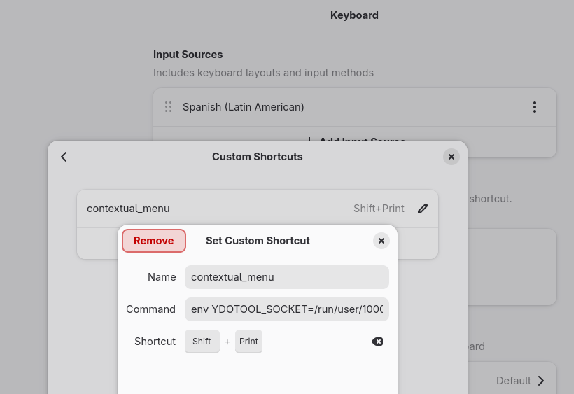

#keyboard #wayland #ydotool

## Configurar permisos de hardware
Agreagar nuestor usuario al grupo input
```bash
sudo usermod -aG input $USER
```
### Crear una regla de udev para el dispositivo virtual uinput
```bash
sudo vim /etc/udev/rules.d/80-uinput.rules
```
conetendido de 
sudo vim /etc/udev/rules.d/80-uinput.rules
```toml
KERNEL=="uinput", GROUP="input", MODE="0660", OPTIONS+="static_node=uinput"
```
Reclargar las reglas de udev

```bash
sudo udevadm control --reload-rules && sudo udevadm trigger
```
**Reiniciar el equipo para aplicar correctamente las reglas**

### Crear la unidad de servicio a nivel usuario de systemd
crear el archivo
```bash
mkdir -p ~/.config/systemd/user/
touch ~/.config/systemd/user/ydotool.service
```
Contendido de 
~/.config/systemd/user/ydotool.service
```toml
[Unit]
Description=ydotool daemon (User Level)
After=default.target

[Service]
ExecStart=/usr/bin/ydotoold
Restart=always
# Opcional: Asegura que el socket tenga los permisos correctos
Environment=YDOTOOL_SOCKET=/run/user/%U/.ydotool_socket

[Install]
WantedBy=default.target
```
### Habilitar el servicio a nivel usuario
```bash
systemctl --user daemon-reload
systemctl --user enable --now ydotool
systemctl --user status ydotool
```

### Configurar el atajo personalizado en gnome
- nombre: contextual_menu
- comando: env YDOTOOL_SOCKET=/run/user/1000/.ydotool_socket ydotool key 42:1 68:1 68:0 42:0
- atajo: Shft + PrintScreen


### Eliminar el retraso del mouse DWT
```bash
gsettings set org.gnome.desktop.peripherals.touchpad disable-while-typing false
```
También funciona deshabilitar la opción de: sidable tochpad when writing en gnome settings
### Troubleshooting


```bash
srw-------.  1 root   root     0 Jun 19 11:06 .ydotool_socket
martin@pc-bdx-mqr:/tmp$ rm -rf .ydotool_socket 
rm: cannot remove '.ydotool_socket': Operation not permitted
martin@pc-bdx-mqr:/tmp$ sudo rm -rf .ydotool_socket 
```
