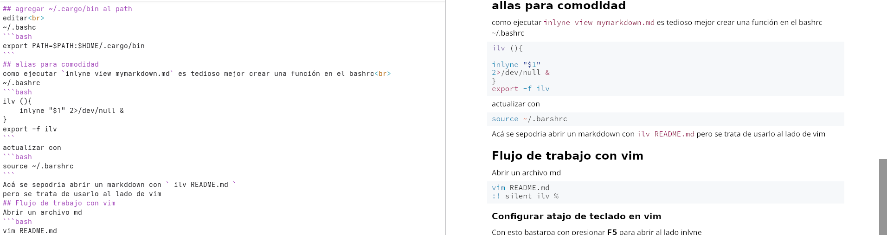

# Inlyne 
Visor de markdown ligero en RUSt
pensado para acompañar el editor de código favorito.
Para este ejemplo se configura para trabajar al lado de vim
## instalacion de inlyne
Necesitamos cargo, lo instalamos desde los repos de fedora
```bash
sudo dnf install cargo
```
## Instalacion de inlyne con cargo
```bash
cargo install inlyne
```
bueno se va a traer hasta la cuchara de la cocina, 627 paquetes a descargar y luego
compilar, pero parace que se pueden dejar para reutilizar despues
en todo caso en caso de querer limpiarlos
```bash
cargo clean
```
## agregar ~/.cargo/bin al path
editar<br>
~/.bashc
```bash
export PATH=$PATH:$HOME/.cargo/bin
```
## alias para comodidad
como ejecutar `inlyne view mymarkdown.md` es tedioso mejor crear una función en el bashrc<br>
~/.bashrc
```bash
ilv (){
    inlyne "$1" 2>/dev/null &
}
export -f ilv
```
actualizar con 
```bash
source ~/.barshrc
```
Acá se sepodria abrir un markddown con ` ilv README.md `
pero se trata de usarlo al lado de vim
## Flujo de trabajo con vim
Abrir un archivo md
```bash
vim README.md
:! silent ilv %
```
### Configurar atajo de teclado en vim
Con esto bastarpa con presionar **F5** para abrir al lado inlyne<br>
~/.vimrc
```vim
nnoremap <F5> :silent !ilv %<CR>:redraw!<CR>
```
### configurar atajo de teclado para cófigo e imagenes
agregar en <br>
~/.bashrc
```vim
augroup MarkdownSnippets
    autocmd!

    " Atajo para insertar bloque de código (escribe ,c en modo inserción)
    autocmd FileType markdown inoremap ,c ```<CR>```<Esc>k$a

    " Atajo para insertar enlace de imagen (escribe ,i en modo inserción)
    autocmd FileType markdown inoremap ,i <Left><Left><Left>
augroup END
```
Con esto ya es mas ya se puede editar markdown muy eficiente<br>

