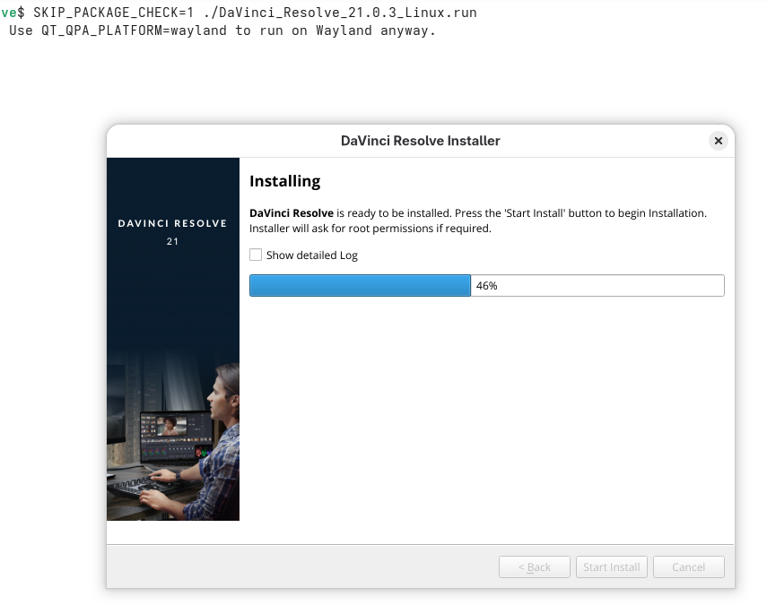
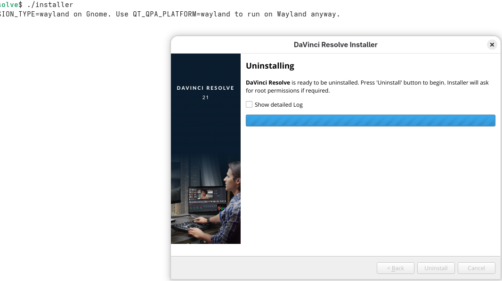

# Instalar davinci Resolve en fedora 44
La version free del software es davinci resolve<br>
la version de paga es davinci studio
## Descargar de la pagina oficial

## Descomprimir y ejecutar
```bash
unzip DaVinci_Resolve_21.0.3_Linux.zip 
./ DaVinci_Resolve_21.0.3_Linux.zip 
```
Seguramente ocurrirá un problema con las librerias zlib
basta con asegurarse que se euncuentran instaladas, sabienso eso se puede
omitir verificar las librerias
### omitir verificar librerias
```bash
SKIP_PACKAGE_CHECK=1 ./DaVinci_Resolve_21.0.3_Linux.run
```
Con esto se logra instalar el software


## Ejecutar el software
Deberia ejecutar desde el lanzador de gnome, pero en mi caso no funcionó

Asi que toco ir a la ruta del ejecutable en 
```txt
/opt/resolve/bin
```
para ejecutar directamente
```bash
./resolve
```
para darse cueta que estra tratando de usar la librería **libcrypt.so.1**
asi que con DFF
#### instalar librería faltante
```bash
dnf provides
#libxcrypt-compat-4.5.2-3.fc44.i686 : Compatibility library providing legacy API functions
#Repo         : fedora
#Matched From : 
#Provide      : libxcrypt-compat = 4.5.2-3.fc44
sudo dnf install libxcrypt-compat
#Installing:
# libxcrypt-compat
```
Ahora si abre el desgraciado solo para quejarse de la GPU<br>


## Desinstalar
La pobresa, ocupa gráfia integrada


