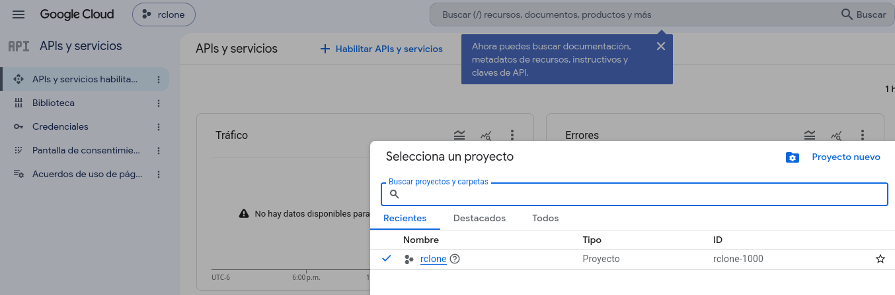
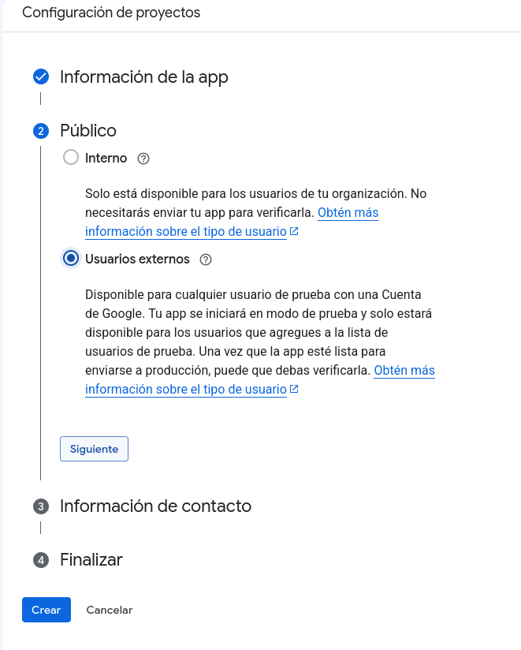
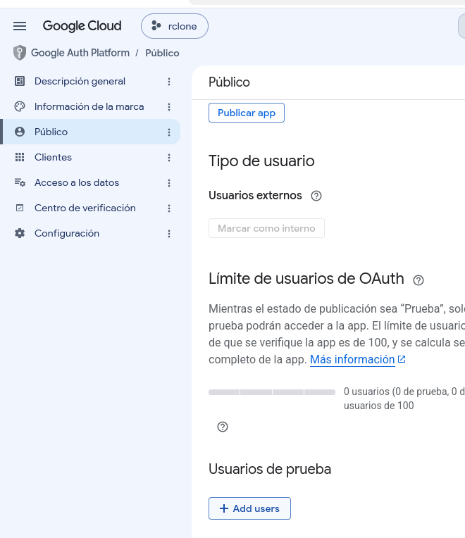
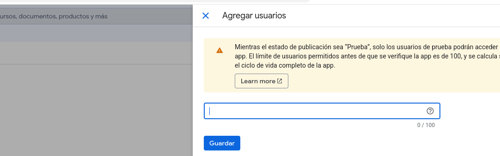
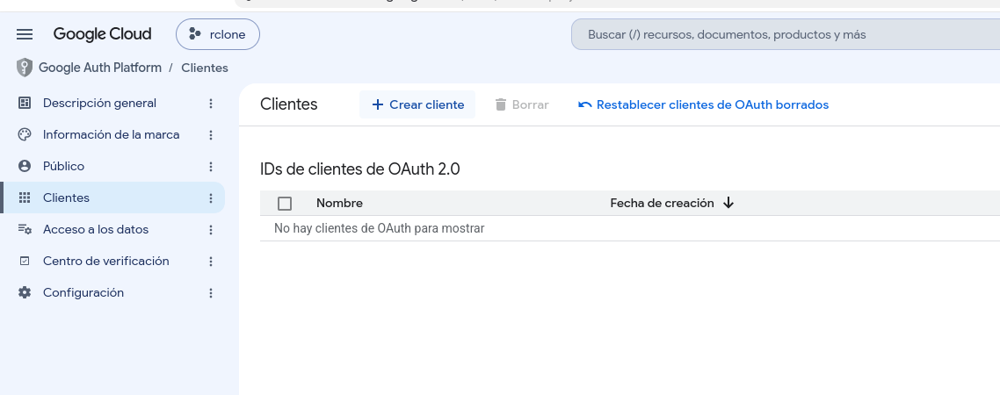
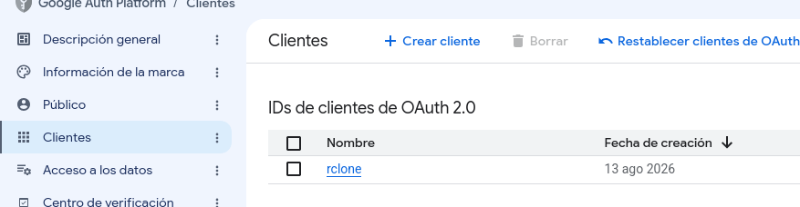
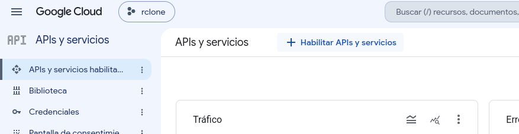
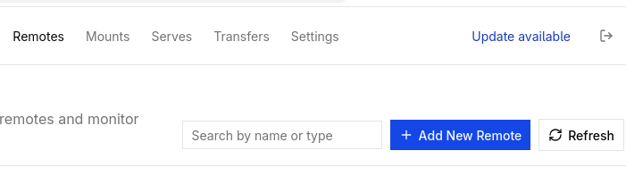
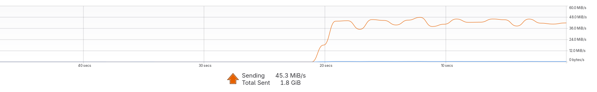

# Rclone con systemd [Unit] para google drive
### Requisisto

 - Tener instalado rclone
 ```bash
 sudo dnf install rclone
 ```
## Crear una API Key de Google Drive para Rclone
Visitar la consola de desarrolladores
[console.developers.google.com](https://console.developers.google.com)
### Seleccionar o crear un proyecto nuevo

 
### Pantalla de Concentimiento

[console.cloud.google.com/auth/overview](https://console.cloud.google.com/auth/overview)
<br>
Seleccionar extern users para cuentas regulares y para el caso de workspace intern


Como en mi caso es una cuenta regular, ahora debo agregar el correo del usuario a los usuarios de prueba
<br>

aca pongo mi correo
<br>


### Crear un cliente
Crear un cliente

Se crea y respalda su api-key para luego usarla en rclone para crear el remote
<br>

En este momento, todavía genera algun error
### Habilitar las APIs y servicios
desde
 [console.cloud.google.com](https://console.cloud.google.com)
Seleccionar habilitar apis y servicios
<br>

<br>
Acá seleccionar el servicio de google drive
y habilitarlo.
Con esto ahora  si podemos pasar a crear el remote en la gui de rclone

## Crear Remote
En la terminal ejecutar
```bash
rclone gui
```
Seleccionar remotes -> Add new remote


Colocar

- client_id
- client_secret
- scope: full
- nombre
 Y los datos solicitados
Se abrirá la ventana para seleccionar la cuenta y aceptar los permisos

Despues de eso, en la gui de rclone aparecerá otro remote

## [UNIT] de systemd
En el directorio
$HOME/.config/systemd/user
Se crea el archivo de unidad
rclone-myremote.service
```toml
[Unit]
Description=mount myremote using rclone
AssertPathIsDirectory=%h/mounts/myremote

[Service]
Type=notify
ExecStart=/usr/bin/rclone mount myremote: %h/mounts/myremote \
    --vfs-cache-mode full \
    --vfs-cache-max-age 48h \
    --vfs-cache-max-size 30G \
    --vfs-write-back 15s \
    --dir-cache-time 10m \
    --drive-chunk-size 128M \
    --transfers 4
ExecStop=/usr/bin/fusermount -u %h/mounts/myremote
Restart=always
RestartSec=10

[Install]
WantedBy=default.target

```

### Crear la carpeta necesaria para montar el remote
Se crea la carpeta necesaria para montar este remote de rclone
```bash
mkdir -p $HOME/mounts/myremote
```

### Habilitar e iniciar el servicio con systemd
Finalmente habilitamos e iniciamos el servicio

```bash
systemctl --user enable rclone-myremote.service
systemctl --user start rclone-myremote.service
systemctl --user status rclone-myremote.service
```

## Velocidad de subida de Rcone
Una excelente noticia es que Rclone aprovecha al máximo la velocidad de subida y bajada de la conexión a internet.


